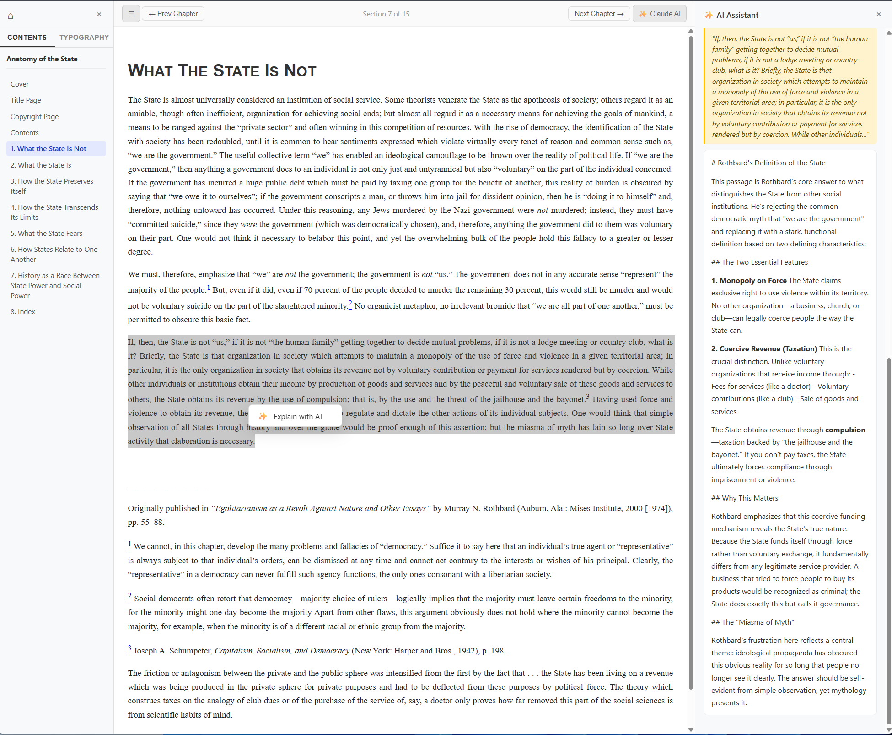

# Reader3 — Your Personal EPUB Library

A lightweight, self-hosted EPUB reader that runs in your browser. Add books, scroll through chapters, and use Claude AI to explain passages as you read.



---

## What You Need

- A Windows, Mac, or Linux computer
- An internet connection (only for the first-time setup)
- That's it — no programming knowledge required

---

## Step 1 — Download the Project

1. Click the green **Code** button at the top of this page
2. Click **Download ZIP**
3. Once downloaded, **right-click** the ZIP file and select **Extract All** (Windows) or double-click it (Mac)
4. Move the extracted folder somewhere easy to find, like your Desktop or Documents

---

## Step 2 — Start the App

### On Windows

1. Open the **`reader3`** folder you just extracted
2. Double-click **`start.bat`**
3. A black command window will appear — this is normal, leave it open
4. Your browser will open automatically at **http://localhost:8123**

> **First time only:** The setup will install a small tool called `uv` and download the required packages. This takes about 1–2 minutes depending on your internet speed. It will not happen again on future runs.

### On Mac or Linux

1. Open **Terminal** (search for it in Spotlight on Mac)
2. Type `cd ` (with a space after it), then drag the `reader3` folder into the Terminal window and press Enter
3. Run this command once to allow the script to run:
   ```
   chmod +x start.sh
   ```
4. Then start the app:
   ```
   ./start.sh
   ```
5. Your browser will open automatically at **http://localhost:8123**

---

## Step 3 — Add Your First Book

You can get free EPUB books from [Project Gutenberg](https://www.gutenberg.org/) — search for any book and download the **EPUB** version.

Once you have an `.epub` file:

1. Go to **http://localhost:8123** in your browser
2. **Drag and drop** the `.epub` file anywhere onto the browser window
3. A purple screen will appear while the book is being processed
4. Once done, the book opens automatically — and it's saved to your library forever

You can also click **"Drop an EPUB anywhere, or click to browse"** to pick a file using a file picker instead of dragging.

---

## Step 4 — Reading a Book

- **Scroll** up and down to read through the chapter
- Use the **Contents** panel on the left to jump to any chapter
- Use **← Prev Chapter** and **Next Chapter →** buttons in the top bar to move between chapters
- Adjust font size, font family, line height, and zoom in the **Typography** tab on the left panel
- Press **← →** arrow keys to jump between chapters

---

## Step 5 — Using the AI Assistant (Optional)

The reader has a built-in AI assistant powered by **Claude** (by Anthropic) that can explain any passage you select.

### Get a free API key

1. Go to [console.anthropic.com](https://console.anthropic.com/settings/keys)
2. Sign up for a free account
3. Click **Create Key**, give it a name, and copy the key (`...`)

### Add the key to the app

1. Inside the `reader3` folder, create a new text file called **`key.env`**
   - On Windows: right-click inside the folder → New → Text Document → type the name `key.env` and press Enter
   - On Mac: open TextEdit → Format → Make Plain Text → Save As `key.env`
2. Open `key.env` and add this line, replacing the placeholder with your actual key:
   ```
   ANTHROPIC_API_KEY=your-key-here
   ```
3. Save the file and restart the app

> **Note:** The file can be named anything as long as it ends in `.env` (e.g. `key.env`, `mykey.env`). Place it directly inside the `reader3` folder — not inside any subfolder. When you start the app, the command window will confirm with **"API key loaded from key.env"**.

### How to use it

1. Click the **✨ Claude AI** button in the top-right corner to open the AI panel
2. Select any text in the book with your mouse
3. Right-click and choose **"Explain with AI"**
4. Claude will explain the passage in the context of the book

---

## Important — Keep the Window Open

> **Do not close the command window (CMD) while you are using the app in your browser.**
> The command window is the engine running the server. If you close it, the app will stop working and you will see an error in your browser.
>
> Just leave it running in the background while you read. You can minimise it.

## Stopping the App

When you are finished reading and want to fully close the app:

- **Windows:** Press `Ctrl + C` inside the command window, then close it
- **Mac/Linux:** Press `Ctrl + C` in the Terminal

---

## Starting Again Next Time

Just repeat Step 2 — double-click `start.bat` (Windows) or run `./start.sh` (Mac/Linux). Dependencies are already installed so it starts in seconds.

---

## Troubleshooting

**The browser doesn't open automatically**
→ Open your browser manually and go to **http://localhost:8123**

**"uv is not recognized" error on Windows**
→ Close the command window and open a fresh one, then try `start.bat` again

**Port already in use**
→ The app will automatically try the next available port. Check the command window for the actual URL (e.g., `http://127.0.0.1:8124`)

**Book shows blank pages**
→ Try a different EPUB file. Some heavily formatted EPUBs from certain publishers may not render correctly.

**The AI says "API key not configured"**
→ Make sure your `key.env` file is saved directly inside the `reader3` folder (not in a subfolder) and contains the line `ANTHROPIC_API_KEY=sk-ant-...` with your actual key. Restart the app after saving it.

---

## Your Library

Every book you add is stored in the `reader3` folder as a subfolder ending in `_data`. To remove a book from your library, simply delete that folder and refresh the browser.

---

## License

free to use, modify, and share.
